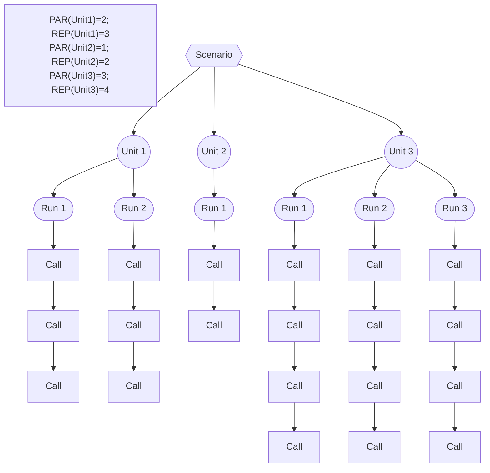

# dbstress

 [](https://github.com/semberal/dbstress/actions)

## Introduction

_dbstress_ is an open-source database performance and stress testing tool written in
[Scala](http://www.scala-lang.org/) and [Akka](http://akka.io). It runs a database query
(using a database-specific JDBC driver) certain number of times in parallel (possibly against multiple database hosts)
and generates a CSV with summarized results.

## Prerequisites
* Java 8 or later

## Obtaining and running

Download the latest release from the [releases page](https://github.com/semberal/dbstress/releases). 

Two command line arguments are mandatory: _scenario configuration_ and _output directory_:

```bash
bin/dbstress -c /path/to/scenario_config.yaml -o /output/directory
```

The application doesn't bundle any JDBC drivers. You'll need to download the driver for your database and place
it into the `lib/` directory.

## Configuration and terminology

Top level configuration element is a _scenario_, which consists of at least one _unit_.
A _unit_ represents a particular database operation, along with its configuration.
All configured units within a scenario run in parallel, independently of each other and their results are also
reported separately. Unless you need to do some more advanced testing, such as connecting to different database hosts, with
different users or to different schemas, it is perfectly fine to have a scenario with just a single unit.

Unit configuration consists of:

* Unit name - must be an alphanumeric string
* Description - optional
* Database query
* Connection URI
* JDBC driver class name - optional, only specify if it cannot be detected automatically
* Database username
* Database password - optional if provided on command line
* Number of parallel database connections - further referred as `PAR`
* How many times should the query be repeated - further referred as `REP`
* Connection initialization timeout - optional

Here is an example of a scenario configuration with two units:

```yaml
---
unit_name: unit1
description: Example of a successful unit # optional
query: select 1
uri: "jdbc:h2:mem://localhost"
driver_class: org.h2.Driver # Optional, only specify if java cannot detect it
username: user1
password: "password" # optional if provided on command line
parallel_connections: 5
repeats: 10
connection_timeout: 3000 # in ms, optional
---
unit_name: unit2
description: Example of an unit the queries of which will always fail
query: zelect 1
uri: "jdbc:h2:mem://localhost"
driver_class: org.h2.Driver
username: sa
password: ""
parallel_connections: 4
repeats: 50
connection_timeout: 500
```

The test run consists of two base phases: _connection initialization phase_ and _query execution phase_.
In the _connection initialization phase_, each unit spawns `PAR` so called _unit runs_.
Every _unit run_ opens a database connection.
In the _query execution phase_, every unit run sends the configured query `REP` times sequentially to the database.
Therefore, every unit sends the query to the database `PAR*REP` times.

The following diagram shows the meaning of the `PAR` and `REP` variables, as well as the overall description of
individual components and how they parallelize:



### Threading
In _dbstress_, there are two important thread pools. The first one is used by the Akka internally and can spawn up
to 64 threads (it will be usually much less).

The other thread pool is used for execution of the blocking database calls.
The number of threads in this thread pool is equal to the total number of database connections across all units.

### Database calls labelling

In order to identify individual database calls in the server logs, you can place a random identifier into
each query. _dbstress_ supports query labeling with the `@@gen_query_id@@` placeholder. Each occurrence of such
placeholder will be replaced with a unique identifier consisting of the following underscore-separated components:

* Scenario ID
* Connection ID
* Query ID

Here is an example unit configuration:

```yaml
---
unit_name: unit1
description: Example of a successful unit
query: "select /*+label(@@gen_query_id@@) */ 1"
uri: "jdbc:h2:mem://localhost"
driver_class: org.h2.Driver
username: sa
password: ""
parallel_connections: 2
repeats: 5
connection_timeout: 500
query_timeout: 500
```

To illustrate how can such labeling can be useful, let's consider debugging and profiling
[query labels](https://my.vertica.com/docs/7.1.x/HTML/Content/Authoring/AdministratorsGuide/Profiling/HowToLabelQueriesForProfiling.htm)
of HPE Vertica. Labels provide an easy way how to pair the test query executions with the database server log entries.

### Error handling

Various kinds of errors can occur during the scenario run, two most important categories of errors are
_connection initialization errors_ and _query errors_.

When a connection initialization fails (either due to an exception or a timeout),
_dbstress_ does not proceed to the _query execution phase_ and terminates immediately.

Query errors, on the other hand, do not stop the scenario, but they are reported as failures in the resulting CSV.

The following list summarizes the various exit status codes:

* 0: Success, output CSV generated. Individual queries still may have failed, though
* 1: Error, incorrect command line arguments
* 2: Error during parsing the configuration YAML file
* 3: Some database connections could not be initialised
* 4: Scenario timeout
* 10+: Unexpected application errors, should be reported as bugs

## Results

When a scenario run finishes, it creates file `summary.${timestamp}.csv` in the output directory.

The CSV file contains summary statistics (min, max, mean, median and standard deviation) calculated
from connection initializations and all/successful/failed database calls.

## Issues
If you have any problem with the application, find a bug or encounter an unexpected behaviour,
please [create an issue](https://github.com/semberal/dbstress/issues/new).
